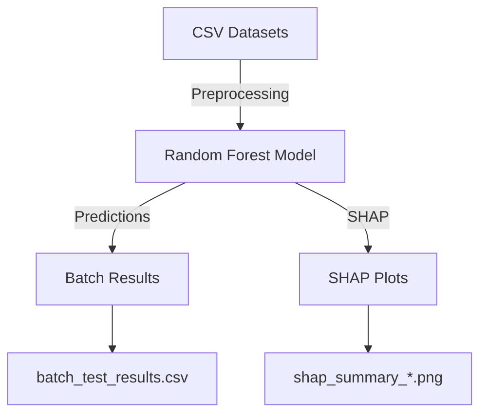

# 🧠 Customer Churn Prediction


## 🚀 Overview
Predict customer churn using advanced machine learning techniques, batch test multiple datasets, and explain model decisions with SHAP—all in a transparent, reproducible pipeline.

---

## 📊 Project Structure
```text
churn-prediction/
├── batch_train_test.py         # Batch training/testing script
├── customer_churn_sample.csv  # Example dataset
├── customer_churn_test.csv    # Example dataset
├── customer_data.csv          # Realistic dataset
├── model_*.joblib             # Saved models
├── scaler_*.joblib            # Saved scalers
├── shap_summary_*.png         # SHAP summary plots
├── batch_test_results.csv     # Batch test results
└── README.md                  # This file
```

---

## 🛠️ Features
- **Batch Model Training & Testing**: Train and evaluate on multiple datasets in one go.
- **Automated Preprocessing**: Handles categorical and numeric features.
- **Model Explainability**: SHAP summary plots for transparency.
- **Reproducible Results**: All outputs saved for review.

---

## 🧩 How It Works



---

## 🚦 Quickstart
1. **Install dependencies:**
   ```sh
   pip install pandas numpy scikit-learn shap joblib matplotlib
   ```
2. **Add your datasets** to the project folder.
3. **Run the batch script:**
   ```sh
   python3 batch_train_test.py
   ```
4. **Review results:**
   - Model metrics in the terminal
   - SHAP plots (`.png` files)
   - Batch results in `batch_test_results.csv`

---

## 📈 Example SHAP Plot


---

## 📜 License

This project is licensed under the MIT License. See [LICENSE](LICENSE) for details.

---

## ✨ Credits
- Built by [jellyfishing2346](https://github.com/jellyfishing2346)
- Powered by Python, scikit-learn, and SHAP

---

## 🏷️ GitHub Topics

Add these topics/tags to your repository for discoverability:

`churn-prediction`, `machine-learning`, `explainable-ai`, `shap`, `scikit-learn`, `batch-processing`, `data-science`, `python`, `automation`, `transparency`, `reproducibility`

---

## 🚧 Potential Improvements
- Add more algorithms (e.g., XGBoost, LightGBM, Logistic Regression)
- Hyperparameter tuning (GridSearchCV, RandomizedSearchCV)
- Cross-validation for robust evaluation
- More feature engineering and handling of missing values
- Additional EDA and visualization
- Unit tests and GitHub Actions CI
- Example Jupyter notebooks
- API documentation (if deployed)
- Simple web UI (Streamlit, Gradio)

---

## 🌐 Deployment Guide

### Deploy as a FastAPI REST API

1. **Install dependencies:**
   ```sh
   pip install -r requirements.txt
   ```
2. **Run locally:**
   ```sh
   uvicorn main:app --reload
   ```
   The API will be available at `http://127.0.0.1:8000`.

3. **Build and run with Docker:**
   ```sh
   docker build -t churn-api .
   docker run -p 80:80 churn-api
   ```

4. **Test the API:**
   - Go to `http://127.0.0.1:8000/docs` for interactive Swagger UI.
   - Example request:
     ```json
     POST /predict
     {
       "MonthlySpend": 80,
       "TotalPurchaseFrequency": 30,
       "Tenure": 12,
       "CustomerType": "VIP"
     }
     ```

5. **Cloud deployment:**
   - Deploy the Docker image to Azure App Service, AWS ECS, GCP Cloud Run, or Heroku for production use.
